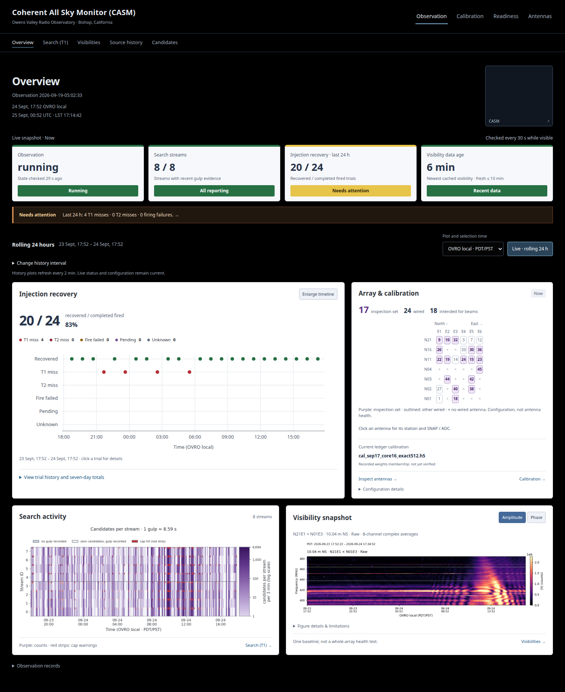
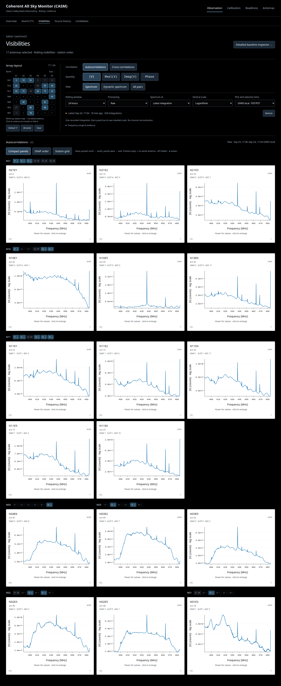
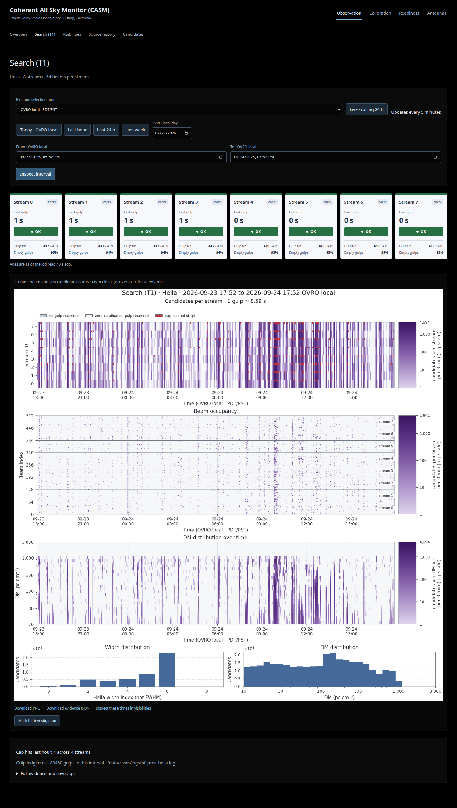
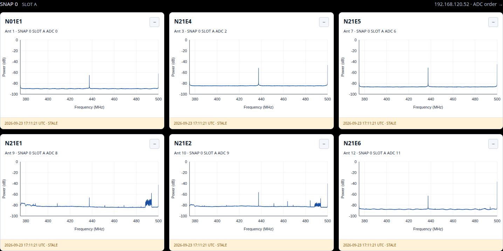
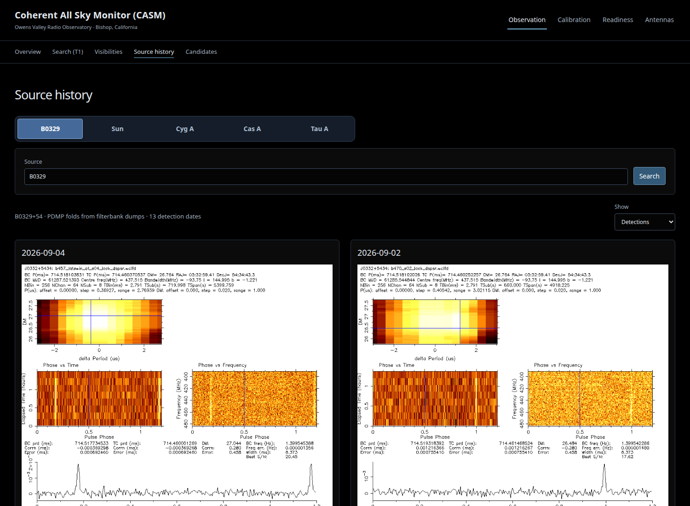
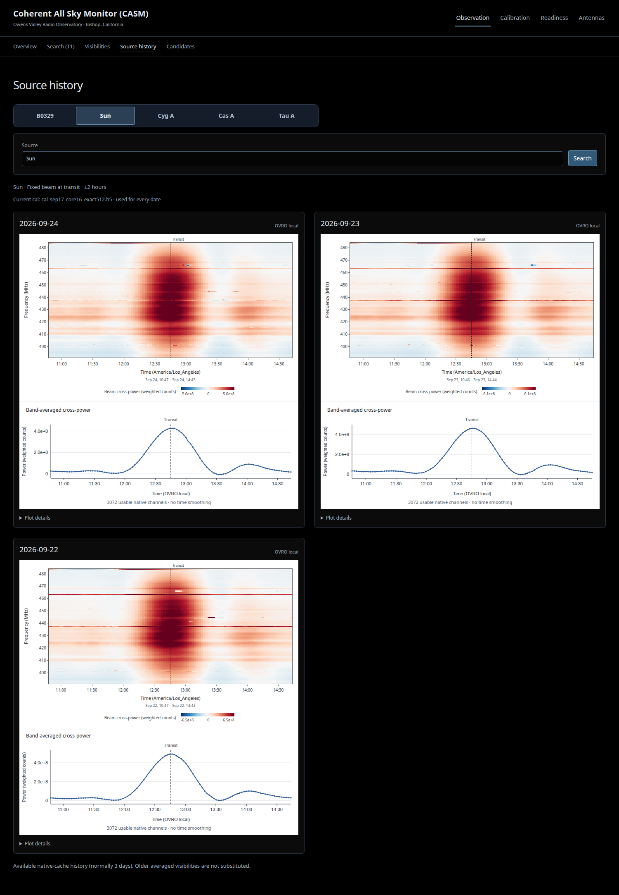

# casm_monitor

Monitoring workspace for the **Coherent All Sky Monitor (CASM)** at
Owens Valley Radio Observatory, Bishop, California. The preview runs on corr1
at `http://localhost:8061`; the separate production monitor remains on 8060.
Observation pages read existing array data and write local display products.

Overview brings together injection recovery, array context and rolling 24-hour
plots. Visibilities opens all 17 inspection antennas, with compact station/SNAP
orders and an upper-triangle pair view. Search (T1) shows stream activity and
candidate distributions. Source history defaults to B0329 PDMP folds; Sun,
Cyg A, Cas A and Tau A show fixed-beam transit spectra and power curves.
SNAPs shows all 4096 board channels in compact SNAP/station layouts, with
all-12-ADC mode, saved historical overlays and per-input power trends.

- [Resources, storage paths and retention](docs/resources-and-storage.md)
- [Visibility views](docs/api-science.md) and [source history](docs/api-commissioning.md#sun-cyg-a-cas-a-and-tau-a-visibility-history)
- [Frontend build and checks](frontend/README.md)
- [SNAP spectra, stored history and acquisition status](docs/snap-spectra.md)

## Run

```bash
cp deploy/systemd/casm-monitor-preview.service ~/.config/systemd/user/
systemctl --user daemon-reload
systemctl --user enable --now casm-monitor-preview
```

Then from your laptop:

```bash
ssh -L 8061:localhost:8061 corr1
```

## Screenshots

Real preview captures from **September 24, 2026 (OVRO local)**, not mock data.
These show the working checkout at capture time, including the existing
Calibration navigation. Capture times, file hashes and service measurements:
[capture manifest](docs/screenshots/2026-09-24/measurements.json).

Overview: injection recovery, array context and rolling 24-hour plots.



Visibilities: white-background autocorrelation spectra in compact station order.



[Cross-correlation dynamic spectra](docs/screenshots/2026-09-24/visibilities-crosses.png)
use the same rolling window and antenna selection.

Search (T1): stream status, candidate heatmaps and distributions.



SNAPs: full-band board spectra, fixed dB scales and saved-read timestamps.
Hourly collector activation is pending; no hardware read was made for these captures.



[Expanded spectrum and drift history](docs/screenshots/2026-09-24/snaps-history-expanded.png).

Source history: B0329 detection dates and saved PDMP folds.



Sun: fixed pointing at transit, waterfall and band-averaged cross-power curve.
The current calibration is applied to each date; these are not flux-calibrated
measurements or a readback of live hardware weights.



Also captured: [Cyg A](docs/screenshots/2026-09-24/sources-cyg-a.png),
[Cas A](docs/screenshots/2026-09-24/sources-cas-a.png) and
[Tau A](docs/screenshots/2026-09-24/sources-tau-a.png).
