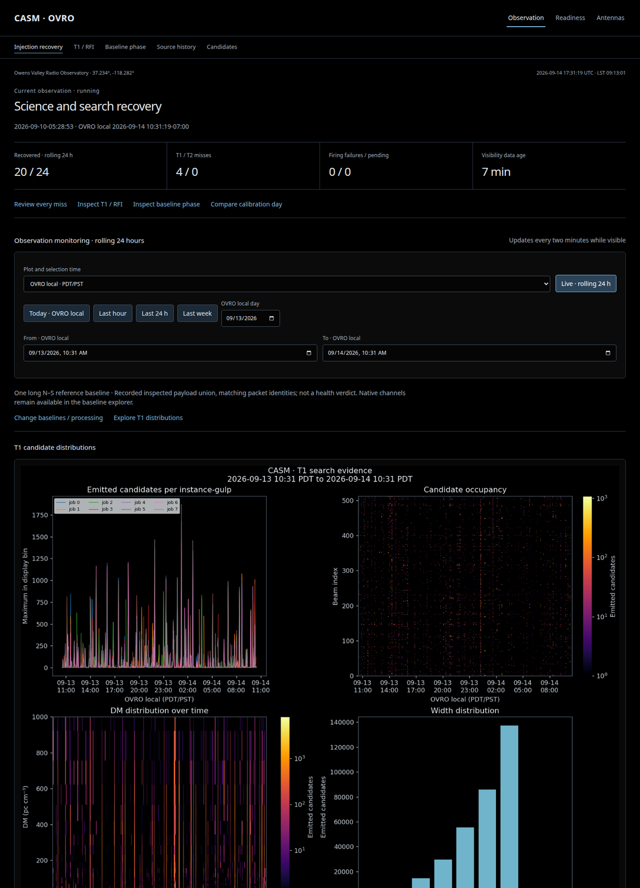
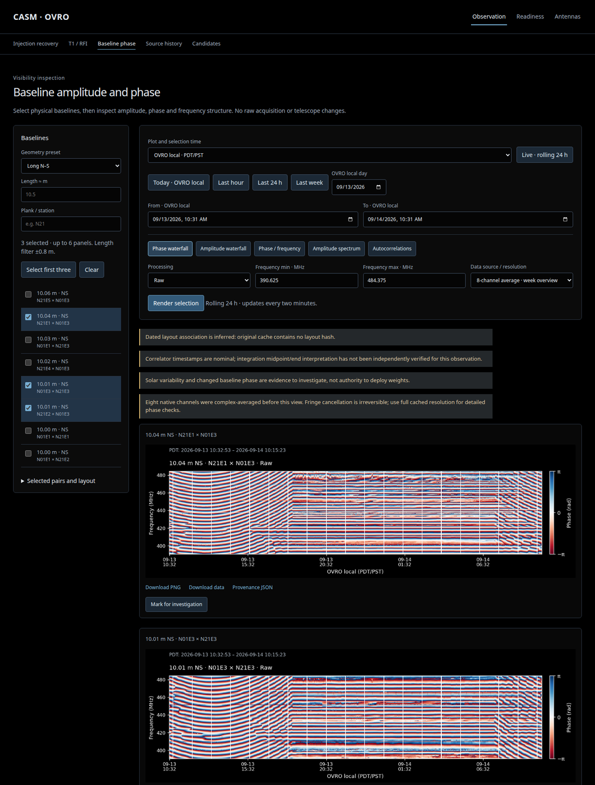
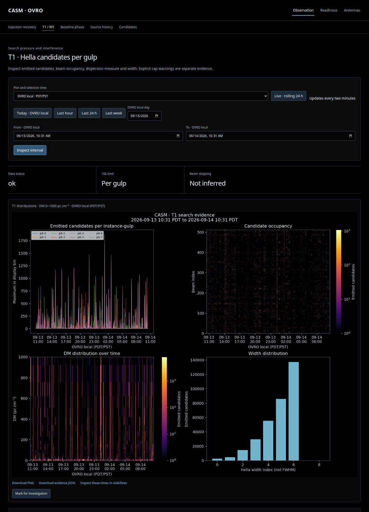
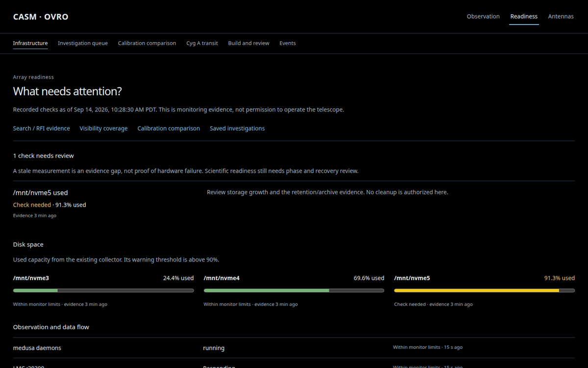
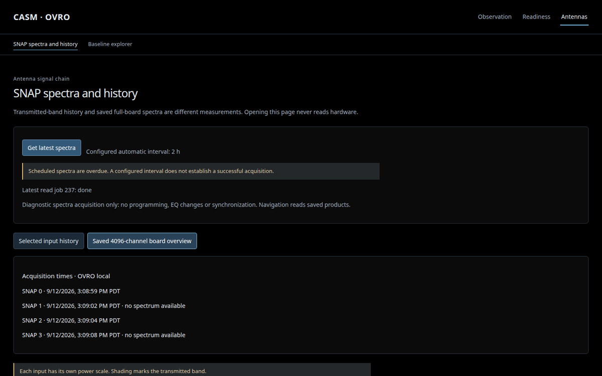

# casm_monitor

Work in progress.

Monitoring workspace for the CASM array at OVRO. Runs on corr1 at
`http://localhost:8061`, read-only against the array data stores.

## Run

```bash
cp deploy/systemd/casm-monitor-preview.service ~/.config/systemd/user/
systemctl --user daemon-reload
systemctl --user enable --now casm-monitor-preview
```

Then from your laptop:

```bash
ssh -L 8061:localhost:8061 corr1
```

## Screenshots

Observation: injection recovery and rolling T1 plots



Baseline phase



T1 / RFI



Readiness



Antennas: SNAP spectra


