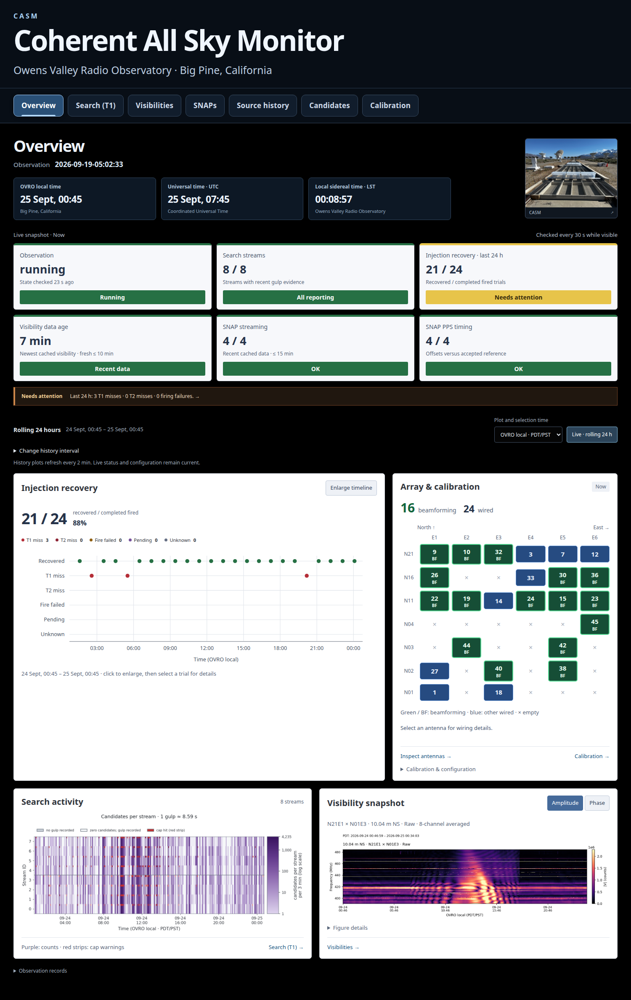
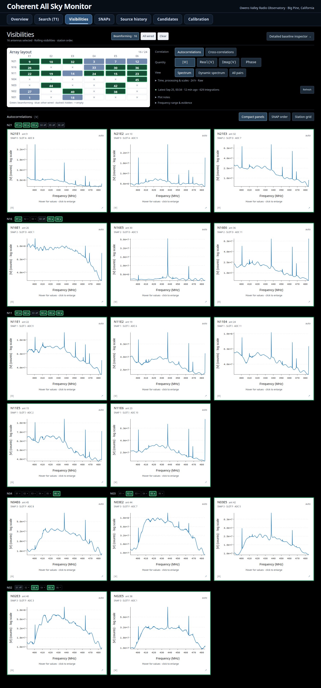
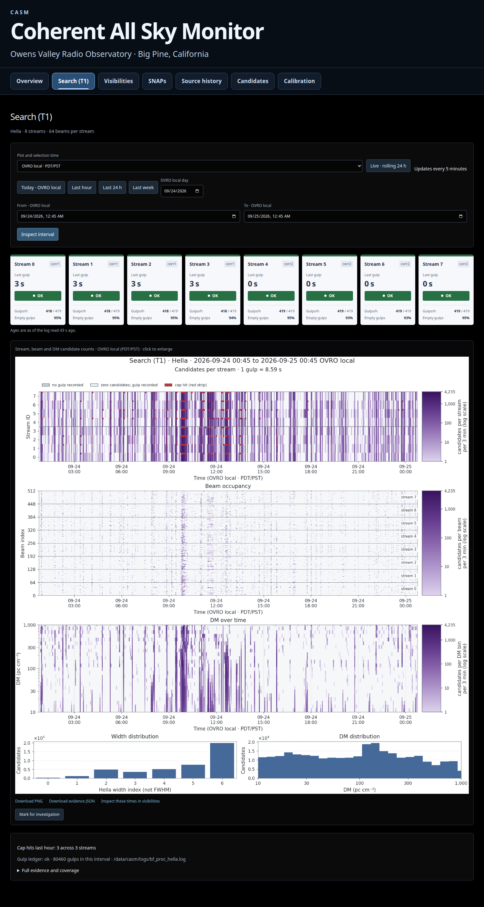
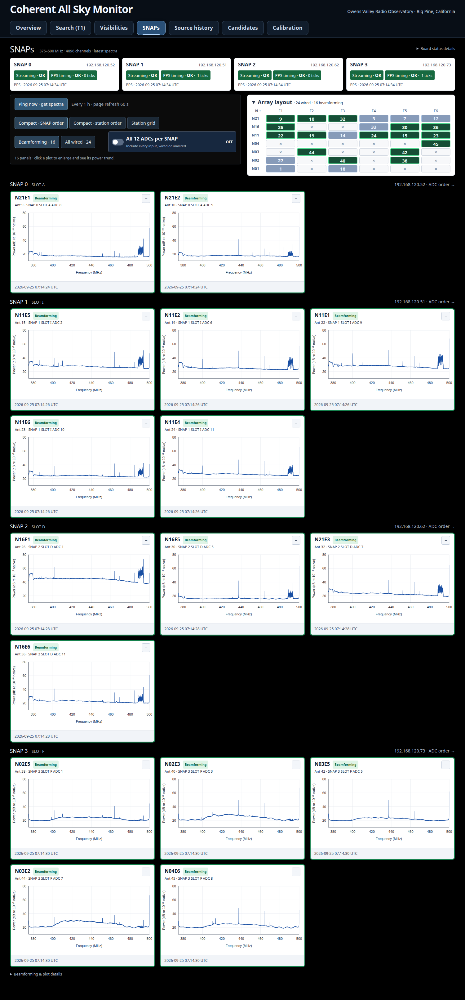
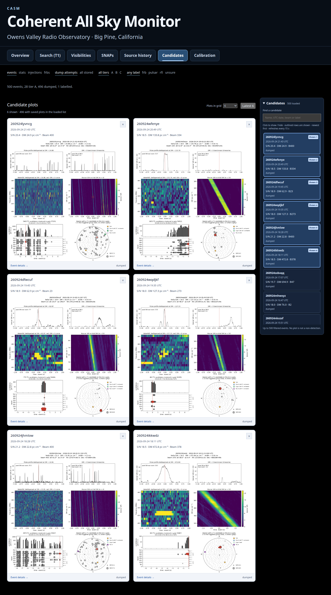
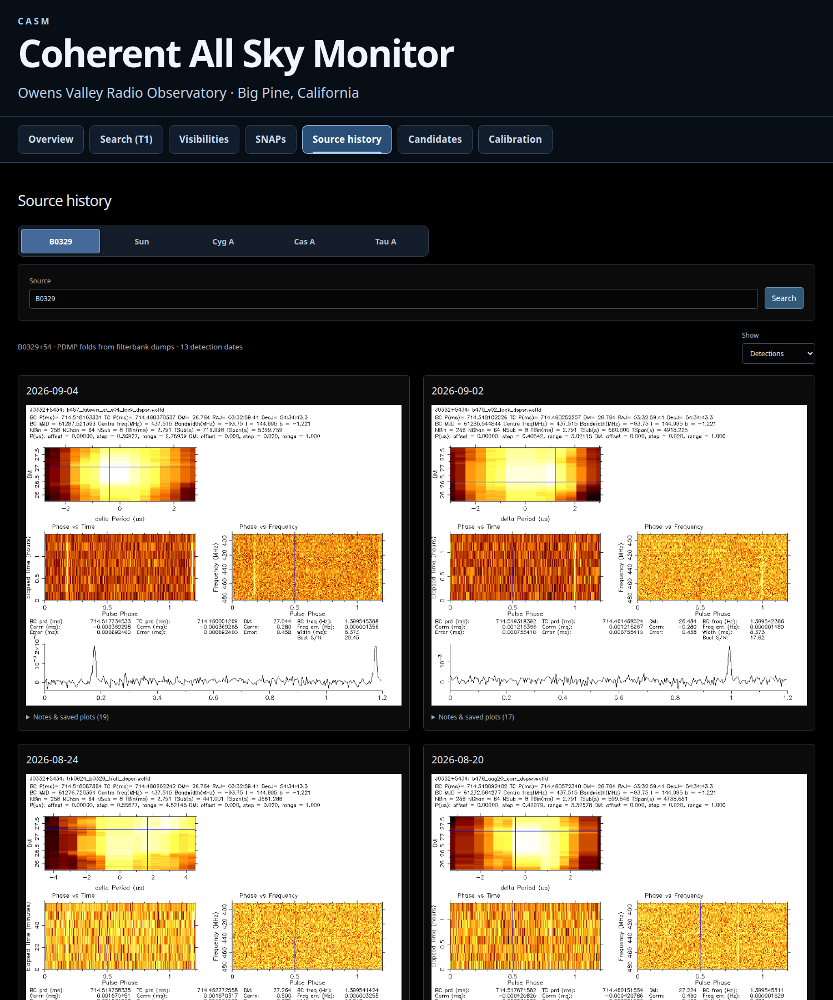
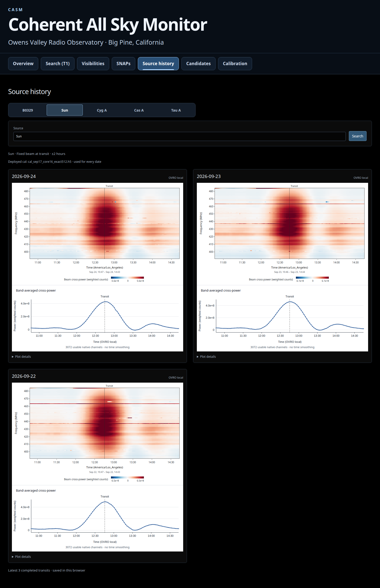

# casm_monitor

Monitoring workspace for the **Coherent All Sky Monitor (CASM)** at
Owens Valley Radio Observatory, Big Pine, California. The preview runs on corr1
at `http://localhost:8061`; the separate production monitor remains on 8060.
Observation pages read existing array data and write local display products.

Rolling 24-hour plots, injection recovery, search activity, visibility spectra,
hourly SNAP spectra/PPS timing, source history and a selectable candidate gallery.
Overview, Visibilities and SNAPs share the deployed beamforming selection.
Click plots to enlarge and zoom.

- [Resources, storage paths and retention](docs/resources-and-storage.md)
- [Visibility views](docs/api-science.md) and [source history](docs/api-commissioning.md#sun-cyg-a-cas-a-and-tau-a-visibility-history)
- [Frontend build and checks](frontend/README.md)
- [SNAP spectra, stored history and acquisition status](docs/snap-spectra.md)
- [Candidate gallery and API](docs/api-cands.md)

## Run

```bash
cp deploy/systemd/casm-monitor-preview.service ~/.config/systemd/user/
systemctl --user daemon-reload
systemctl --user enable --now casm-monitor-preview
```

Then from your laptop:

```bash
ssh -L 8061:localhost:8061 corr1
```

## Screenshots

Real preview captures from **September 25, 2026 (OVRO local)**, using saved
array data, not fixtures. [Capture times and hashes](docs/screenshots/2026-09-25-latest/manifest.json).

Overview: injection recovery, array context and rolling 24-hour plots.



Visibilities: white-background autocorrelation spectra in compact station order.



[Cross-correlation dynamic spectra](docs/screenshots/2026-09-25-latest/visibilities-crosses.png)
use the same rolling window and antenna selection.

Search (T1): stream status, candidate heatmaps and distributions.



SNAPs: hourly full-band spectra and PPS timing, with active beamforming inputs in green.



Candidates: recent plots with a right-hand selector; click a row to show or hide it.



Source history: B0329 detection dates and saved PDMP folds.



Sun: fixed pointing at transit, waterfall and band-averaged cross-power curve.
The latest three completed transits are cached. These curves are not flux-calibrated.


